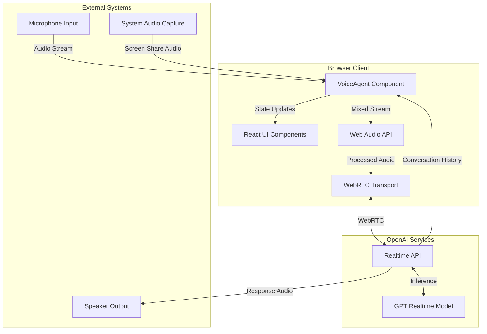
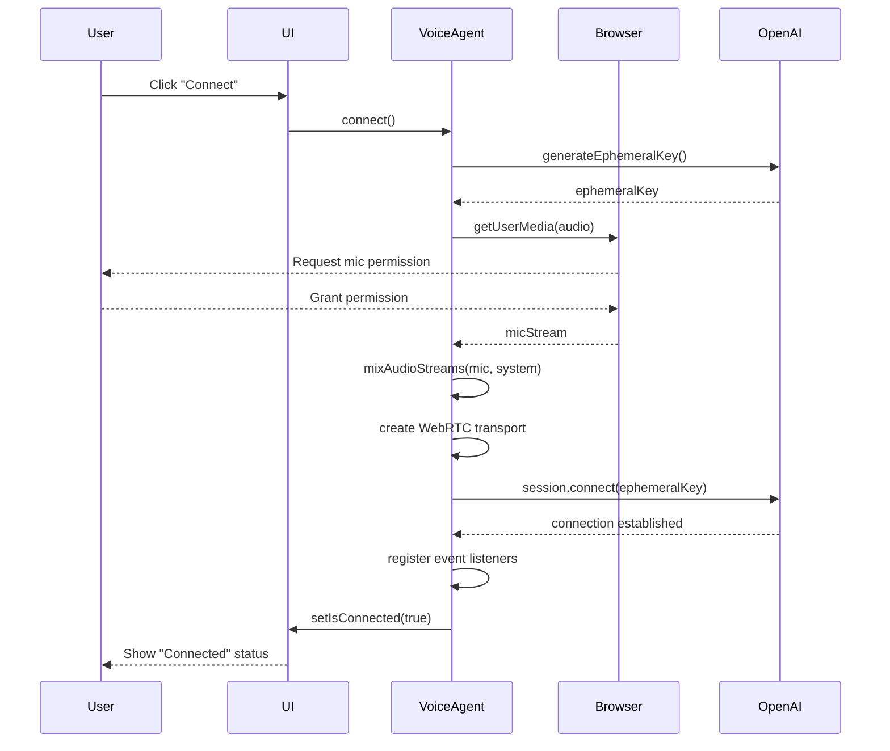
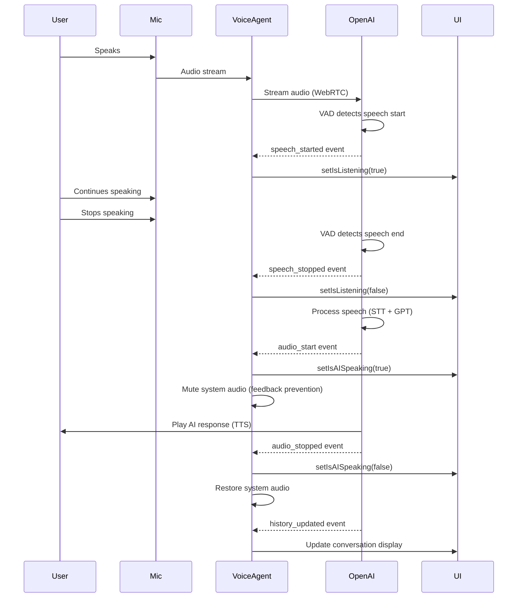
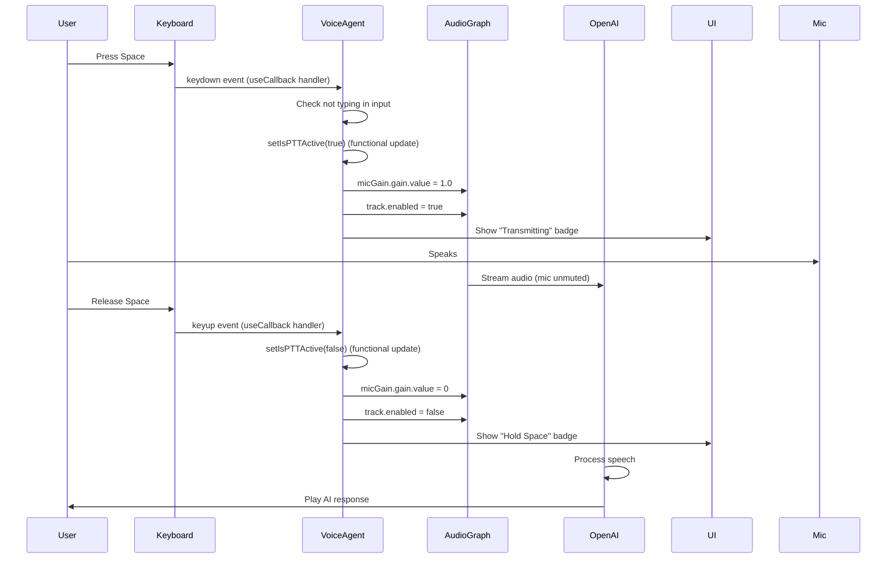
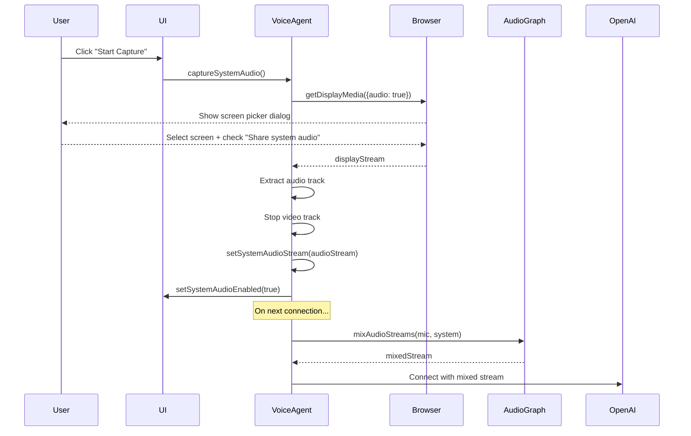
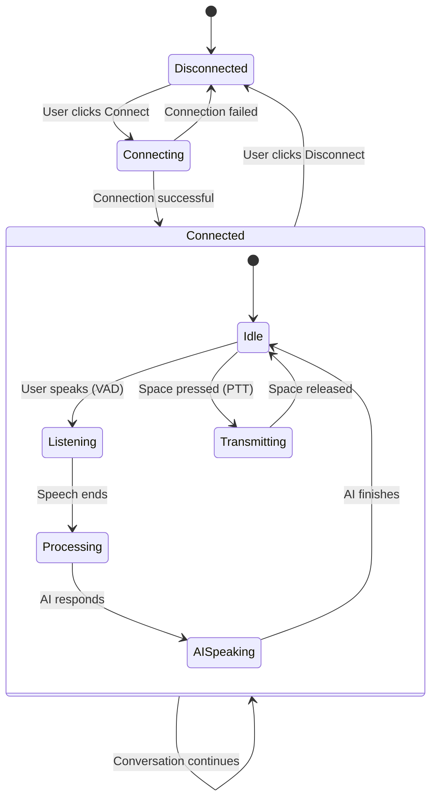

# Architecture Overview

Comprehensive architecture documentation for the GPT Realtime Voice Agent application.

## Table of Contents

1. [System Architecture](#system-architecture)
2. [Component Architecture](#component-architecture)
3. [Data Flow](#data-flow)
4. [Audio Processing Pipeline](#audio-processing-pipeline)
5. [State Management](#state-management)
6. [API Integration](#api-integration)
7. [Security Considerations](#security-considerations)
8. [Performance Characteristics](#performance-characteristics)

## System Architecture

### High-Level Overview



### Technology Stack

| Layer | Technology | Purpose |
|-------|-----------|---------|
| **Framework** | Next.js 15.5.6 | React framework with App Router |
| **UI Library** | React 19.1.0 | Component-based UI |
| **Language** | TypeScript 5 | Type-safe development |
| **Styling** | Tailwind CSS v4 | Utility-first CSS |
| **Components** | shadcn/ui + Radix UI | Accessible UI components |
| **Icons** | Lucide React | Icon library |
| **AI SDK** | @openai/agents 0.1.10 | Realtime API integration |
| **Audio** | Web Audio API | Audio processing and mixing |
| **Transport** | WebRTC | Low-latency audio streaming |

### Deployment Architecture

```
┌─────────────────────────────────────────────┐
│           Browser (Client-Side)             │
│                                             │
│  ┌─────────────────────────────────────┐   │
│  │     Next.js Application             │   │
│  │                                     │   │
│  │  ┌──────────────────────────────┐  │   │
│  │  │   VoiceAgent Component       │  │   │
│  │  │                              │  │   │
│  │  │  • State Management          │  │   │
│  │  │  • Audio Processing          │  │   │
│  │  │  • Event Handling            │  │   │
│  │  │  • UI Rendering              │  │   │
│  │  └──────────────────────────────┘  │   │
│  │                                     │   │
│  │  ┌──────────────────────────────┐  │   │
│  │  │   shadcn/ui Components       │  │   │
│  │  └──────────────────────────────┘  │   │
│  └─────────────────────────────────────┘   │
│                                             │
│  ┌─────────────────────────────────────┐   │
│  │     Browser APIs                    │   │
│  │                                     │   │
│  │  • MediaDevices API (mic/speaker)  │   │
│  │  • Web Audio API (mixing)          │   │
│  │  • getDisplayMedia (system audio)  │   │
│  │  • Keyboard Events (PTT)           │   │
│  └─────────────────────────────────────┘   │
└─────────────────────────────────────────────┘
                    ↕
              [WebRTC Connection]
                    ↕
┌─────────────────────────────────────────────┐
│         OpenAI Realtime API                 │
│                                             │
│  • Speech-to-Text                           │
│  • Text-to-Speech                           │
│  • GPT Realtime Model                       │
│  • Voice Activity Detection                 │
│  • Turn Management                          │
└─────────────────────────────────────────────┘
```

## Component Architecture

### VoiceAgent Component Structure

The application follows a single-component architecture where `VoiceAgent.tsx` is the primary component.

```
VoiceAgent Component
│
├── State Management
│   ├── Connection State (isConnected, isConnecting, error)
│   ├── Conversation State (conversationHistory, systemPrompt)
│   ├── Audio State (devices, selectedDevices, systemAudio)
│   ├── Input Control (inputMode, vadMode, isPTTActive)
│   └── UI State (dialogs, visual indicators)
│
├── Refs (Non-reactive)
│   ├── sessionRef (RealtimeSession instance)
│   ├── agentRef (RealtimeAgent instance)
│   ├── audioContextRef (AudioContext)
│   ├── micGainRef (GainNode for mic control)
│   ├── systemAudioGainRef (GainNode for system audio)
│   └── micStreamRef (MediaStream cleanup reference)
│
├── Core Functions
│   ├── connect() - Establish API connection
│   ├── disconnect() - Clean up and close session
│   ├── generateEphemeralKey() - Get temporary API key
│   ├── mixAudioStreams() - Combine audio sources
│   ├── captureSystemAudio() - Get system audio via screen share
│   ├── enumerateAudioDevices() - List audio devices
│   └── updateSystemPrompt() - Change AI behavior
│
├── Event Handlers
│   ├── Keyboard Events (handleKeyDown, handleKeyUp)
│   ├── Session Events (history_updated, audio_start, etc.)
│   └── UI Events (button clicks, dropdown changes)
│
└── UI Components
    ├── Connection Card (status, controls)
    ├── Conversation History (transcript display)
    ├── System Prompt Dialog (behavior customization)
    └── Audio Settings Dialog (device selection, VAD, PTT)
```

### Component Responsibilities

#### VoiceAgent Component

**Primary Responsibilities**:
- Session lifecycle management (connect/disconnect)
- Audio stream capture and mixing
- OpenAI Realtime API integration
- Push-to-Talk functionality
- Voice Activity Detection configuration
- Conversation history display
- Error handling and user feedback

**Not Responsible For**:
- UI component styling (delegated to shadcn/ui)
- API endpoint implementation (uses OpenAI SDK)
- Audio encoding/decoding (handled by WebRTC)

#### UI Components (shadcn/ui)

**Responsibilities**:
- Rendering accessible UI primitives
- Styling with Tailwind CSS
- Keyboard navigation
- ARIA attributes

**Components Used**:
- `Button` - Actions (connect, disconnect, etc.)
- `Card` - Content containers
- `Badge` - Status indicators
- `Dialog` - Modal windows (settings, prompts)
- `Select` - Dropdowns (devices, modes)
- `Textarea` - Multi-line input (system prompt)
- `ScrollArea` - Scrollable content (conversation history)
- `Alert` - Error messages

## Data Flow

### Connection Flow



### Conversation Flow (Always On Mode)



### Push-to-Talk Flow (Dual-Layer Control)

The PTT implementation uses a dual-layer control mechanism for maximum reliability:
1. **GainNode control**: Instant audio muting (<1ms response)
2. **MediaStreamTrack.enabled control**: Complete transmission stopping



### System Audio Capture Flow



## Audio Processing Pipeline

### Audio Graph Architecture

```
┌──────────────┐
│  Microphone  │
│   Device     │
└──────┬───────┘
       │
       ▼
┌────────────────────┐
│ getUserMedia()     │
│ • echoCancellation │
│ • noiseSuppression │
│ • autoGainControl  │
└────────┬───────────┘
         │
         ▼
   ┌──────────────────┐
   │ MediaStreamSource│
   │      Node        │
   └────────┬─────────┘
            │
            ▼
      ┌──────────┐
      │ Gain Node│ ◄──── PTT Control
      │  (Mic)   │       (0 or 1.0)
      └────┬─────┘
           │
           │    ┌─────────────────┐
           │    │ System Audio    │
           │    │ (Screen Share)  │
           │    └────────┬────────┘
           │             │
           │             ▼
           │    ┌──────────────────┐
           │    │ MediaStreamSource│
           │    │      Node        │
           │    └────────┬─────────┘
           │             │
           │             ▼
           │       ┌──────────┐
           │       │Gain Node │ ◄──── Feedback Prevention
           │       │ (System) │       (0 or 0.7)
           │       └────┬─────┘
           │            │
           └────────────┘
                  │
                  ▼
         ┌─────────────────┐
         │   Destination   │
         │      Node       │
         └────────┬────────┘
                  │
                  ▼
          ┌──────────────┐
          │ Mixed Stream │
          └──────┬───────┘
                 │
                 ▼
         ┌──────────────────┐
         │ WebRTC Transport │
         └──────────┬───────┘
                    │
                    ▼
            ┌──────────────┐
            │  OpenAI API  │
            └──────────────┘
```

### Gain Control Values

| Scenario | Mic Gain | System Audio Gain | Reason |
|----------|----------|-------------------|--------|
| **Always On Mode** | 1.0 | 0.7 | Mic always on, system audio balanced |
| **PTT Inactive** | 0.0 | 0.7 | Mic muted (gain + track.enabled=false), system audio active |
| **PTT Active** | 1.0 | 0.7 | Mic enabled (gain + track.enabled=true), system audio active |
| **AI Speaking** | (unchanged) | 0.0 | Prevent feedback loop |
| **AI Finished** | (unchanged) | 0.7 | Restore system audio |

### Audio Constraints

```typescript
const audioConstraints = {
  echoCancellation: true,  // Reduces acoustic echo
  noiseSuppression: true,  // Filters background noise
  autoGainControl: true,   // Normalizes volume levels
  deviceId: selectedDevice ? { exact: selectedDevice } : undefined
};
```

**Why These Constraints**:
- **echoCancellation**: Prevents AI voice from being captured back through speakers
- **noiseSuppression**: Improves speech clarity in noisy environments
- **autoGainControl**: Ensures consistent volume levels

## State Management

### State Categories

#### 1. Connection State

```typescript
const [isConnected, setIsConnected] = useState(false);
const [isConnecting, setIsConnecting] = useState(false);
const [error, setError] = useState<string | null>(null);
```

**Purpose**: Track API connection status and errors

**Transitions**:
- `disconnected` → `connecting` → `connected`
- `connected` → `disconnected`
- Any state → `error`

#### 2. Conversation State

```typescript
const [conversationHistory, setConversationHistory] = useState<RealtimeItem[]>([]);
const [showHistory, setShowHistory] = useState(false);
const [systemPrompt, setSystemPrompt] = useState("You are a helpful assistant.");
```

**Purpose**: Manage conversation data and display

**Updates**: Driven by `history_updated` events from OpenAI API

#### 3. Audio State

```typescript
const [audioDevices, setAudioDevices] = useState<{
  microphones: MediaDeviceInfo[];
  speakers: MediaDeviceInfo[];
}>({ microphones: [], speakers: [] });

const [selectedMicrophone, setSelectedMicrophone] = useState<string>("");
const [selectedSpeaker, setSelectedSpeaker] = useState<string>("");
const [systemAudioEnabled, setSystemAudioEnabled] = useState(false);
const [systemAudioStream, setSystemAudioStream] = useState<MediaStream | null>(null);
```

**Purpose**: Track audio devices and system audio capture

**Updates**: Device enumeration, user selection, system audio capture

#### 4. Input Control State

```typescript
const [inputMode, setInputMode] = useState<InputMode>("always_on");
const [vadMode, setVadMode] = useState<VadMode>("conservative");
const [isPTTActive, setIsPTTActive] = useState(false);
const [isListening, setIsListening] = useState(false);
const [isAISpeaking, setIsAISpeaking] = useState(false);
```

**Purpose**: Control microphone transmission and visual feedback

**Updates**: User input (keyboard, UI), OpenAI events

#### 5. UI State

```typescript
const [isPromptDialogOpen, setIsPromptDialogOpen] = useState(false);
const [isAudioDialogOpen, setIsAudioDialogOpen] = useState(false);
const [tempPrompt, setTempPrompt] = useState("");
const [isLoadingDevices, setIsLoadingDevices] = useState(false);
```

**Purpose**: Manage dialog visibility and loading states

### State Flow Diagram



## API Integration

### OpenAI Realtime API

#### Authentication Flow

```typescript
// 1. Generate ephemeral key (client-side - for development)
const ephemeralKey = await generateEphemeralKey();

// 2. Create agent
const agent = new RealtimeAgent({
  name: "Assistant",
  instructions: systemPrompt
});

// 3. Create transport
const transport = new OpenAIRealtimeWebRTC({
  mediaStream: finalStream
});

// 4. Create session
const session = new RealtimeSession(agent, {
  model: "gpt-realtime",
  transport: transport,
  config: { /* VAD config */ }
});

// 5. Connect
await session.connect({ apiKey: ephemeralKey });
```

#### Event System

| Event | Purpose | Handler |
|-------|---------|---------|
| `history_updated` | Conversation updates | Update transcript UI |
| `input_audio_buffer.speech_started` | User started speaking | Show "Listening" badge |
| `input_audio_buffer.speech_stopped` | User stopped speaking | Hide "Listening" badge |
| `audio_start` | AI started speaking | Mute system audio, show badge |
| `audio_stopped` | AI finished speaking | Restore system audio |
| `audio_interrupted` | User interrupted AI | Restore system audio |
| `error` | Session error | Display error message |

#### Session Configuration

```typescript
{
  model: "gpt-realtime",
  transport: OpenAIRealtimeWebRTC,
  config: {
    audio: {
      input: {
        turnDetection: {
          type: "server_vad" | "semantic_vad",
          // Server VAD parameters
          threshold: 0.5,           // 0.0 - 1.0
          silence_duration_ms: 800, // milliseconds
          prefix_padding_ms: 300,   // milliseconds
          // Semantic VAD parameters
          eagerness: "low" | "medium" | "high"
        }
      }
    }
  }
}
```

## Security Considerations

### Current Implementation (Development)

⚠️ **Client-Side API Key**: The current implementation uses `NEXT_PUBLIC_OPENAI_API_KEY` which is exposed in client-side code.

**Risks**:
- API key visible in browser
- Can be extracted from JavaScript bundle
- No rate limiting per user
- Potential unauthorized usage

**Acceptable For**:
- Development and testing
- Personal/demo applications
- Trusted user base

### Recommended Production Implementation

#### Server-Side Key Generation

```typescript
// Server Route: app/api/realtime-token/route.ts
export async function POST(request: Request) {
  // Authenticate user (session, JWT, etc.)
  const user = await authenticateUser(request);
  if (!user) {
    return new Response("Unauthorized", { status: 401 });
  }

  // Generate ephemeral key server-side
  const response = await fetch(
    "https://api.openai.com/v1/realtime/client_secrets",
    {
      method: "POST",
      headers: {
        Authorization: `Bearer ${process.env.OPENAI_API_KEY}`, // Server-only
        "Content-Type": "application/json",
      },
      body: JSON.stringify({
        session: {
          type: "realtime",
          model: "gpt-realtime",
        },
      }),
    }
  );

  const data = await response.json();
  return Response.json({ ephemeralKey: data.value });
}

// Client-Side: Use server endpoint
const generateEphemeralKey = async (): Promise<string> => {
  const response = await fetch("/api/realtime-token", {
    method: "POST",
    credentials: "include", // Include auth cookies
  });

  if (!response.ok) {
    throw new Error("Failed to get ephemeral key");
  }

  const data = await response.json();
  return data.ephemeralKey;
};
```

#### Additional Security Measures

1. **Rate Limiting**: Limit requests per user/IP
2. **Usage Tracking**: Monitor API usage per user
3. **Session Timeouts**: Expire ephemeral keys after reasonable duration
4. **User Authentication**: Require login before access
5. **CORS Configuration**: Restrict API access to known origins

### Data Privacy

**Audio Data**:
- Microphone audio sent to OpenAI servers
- System audio (if enabled) also sent to OpenAI
- Not stored locally
- Subject to OpenAI's data retention policies

**User Considerations**:
- Inform users about data transmission
- Provide opt-out for system audio
- Link to OpenAI privacy policy
- Consider recording consent for legal compliance

## Performance Characteristics

### Latency Breakdown

| Component | Typical Latency | Notes |
|-----------|----------------|-------|
| **Microphone Capture** | 0-10ms | Browser audio buffer |
| **Audio Mixing** | <10ms | Web Audio API processing |
| **WebRTC Transport** | 50-150ms | Network + encoding |
| **OpenAI Processing** | 200-500ms | STT + GPT inference |
| **Total (User → AI)** | 300-700ms | End-to-end |
| **PTT Activation** | <1ms | Dual-layer: Gain node + Track.enabled update |
| **Feedback Prevention** | <10ms | Event-driven muting |

### Memory Usage

| Component | Approximate Size |
|-----------|-----------------|
| AudioContext | 1-2 MB |
| Audio Nodes (per source) | 100-200 KB |
| MediaStream Buffers | 500 KB - 1 MB |
| Conversation History | ~100 KB per 100 messages |
| **Total Baseline** | 3-5 MB |

### CPU Usage

| Component | CPU Usage (%) |
|-----------|---------------|
| AudioContext Processing | 1-2% |
| WebRTC Encoding | 2-4% |
| React Rendering | <1% |
| **Total (Connected)** | 3-7% |

*Measured on modern hardware (M1 Mac, Intel i7)*

### Network Bandwidth

| Direction | Bandwidth |
|-----------|-----------|
| **Upload** (Audio → OpenAI) | 16-32 kbps |
| **Download** (AI Voice) | 16-32 kbps |
| **Total** | ~40-60 kbps |

*Varies based on audio encoding and quality*

### Scalability Considerations

**Client-Side**:
- Single session per browser tab
- Memory leaks prevented with proper cleanup
- Performance stable over long sessions (tested 1+ hours)

**Server-Side** (OpenAI):
- Handles concurrent users
- No client-side infrastructure needed
- Scales with OpenAI capacity

## Architecture Decision Records

Detailed architectural decisions are documented in separate ADRs:

- [ADR-001: WebRTC Transport](./adr/ADR-001-webrtc-transport.md)
- [ADR-002: Audio Stream Mixing](./adr/ADR-002-audio-stream-mixing.md)
- [ADR-003: Push-to-Talk Implementation](./adr/ADR-003-push-to-talk-implementation.md)
- [ADR-004: Feedback Loop Prevention](./adr/ADR-004-feedback-loop-prevention.md)
- [ADR-005: VAD Configuration](./adr/ADR-005-vad-configuration.md)

## Future Enhancements

### Planned Architectural Improvements

1. **State Management**
   - Consider Zustand or Jotai for complex state
   - Separate audio logic into custom hooks
   - Extract business logic from UI component

2. **Component Structure**
   - Split VoiceAgent into smaller components
   - Create `useVoiceSession` custom hook
   - Create `useAudioMixing` custom hook

3. **Testing Infrastructure**
   - Unit tests for utility functions
   - Integration tests for API interactions
   - E2E tests with Playwright
   - Mock audio streams for testing

4. **Performance**
   - Service Worker for offline support
   - Audio worklet for better performance
   - Lazy load heavy dependencies

5. **Features**
   - Multi-language support (i18n)
   - Conversation recording/export
   - Custom audio effects pipeline
   - Voice biometrics

6. **Security**
   - Server-side key generation (production)
   - User authentication system
   - Rate limiting per user
   - Usage analytics and monitoring
