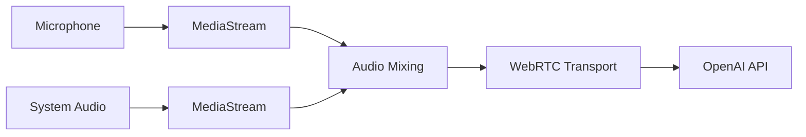

# OpenAI Realtime API Integration

This document describes how the Voice Agent integrates with OpenAI's Realtime API for voice conversations.

## Table of Contents

1. [Overview](#overview)
2. [SDK Integration](#sdk-integration)
3. [Session Configuration](#session-configuration)
4. [Event Listeners](#event-listeners)
5. [Audio Stream Handling](#audio-stream-handling)
6. [Error Handling](#error-handling)
7. [Best Practices](#best-practices)

## Overview

The Voice Agent uses the `@openai/agents` SDK (v0.1.10) to integrate with OpenAI's Realtime API. This provides:

- Real-time bidirectional audio streaming via WebRTC
- Automatic speech-to-text (STT) and text-to-speech (TTS)
- Conversation history management
- Turn detection with Voice Activity Detection (VAD)
- Low-latency voice conversations (<200ms typical)

### Architecture Flow

```
User Microphone
      ↓
[Web Audio API Mixing]
      ↓
[WebRTC Transport]
      ↓
[OpenAI Realtime API]
      ↓
[RealtimeSession]
      ↓
[Event Handlers]
      ↓
UI Updates + Audio Output
```

## SDK Integration

### Dependencies

```json
{
  "@openai/agents": "^0.1.10"
}
```

### Required Imports

```typescript
import {
  RealtimeAgent,
  RealtimeSession,
  RealtimeItem,
  OpenAIRealtimeWebRTC,
} from "@openai/agents/realtime";
```

### Type Definitions

```typescript
// Conversation history item
interface RealtimeItem {
  id: string;
  type: "message" | "function_call" | "function_call_output";
  role?: "user" | "assistant" | "system";
  content?: Array<{
    type?: string;
    text?: string;
    transcript?: string;
  }>;
  status?: string;
}

// Agent configuration
interface RealtimeAgent {
  name: string;
  instructions: string;
}

// Session configuration
interface RealtimeSession {
  on(event: string, callback: Function): void;
  connect(options: { apiKey: string }): Promise<void>;
  updateHistory(items: RealtimeItem[]): void;
  close(): Promise<void>;
}
```

## Session Configuration

### 1. Authentication

The Voice Agent uses **ephemeral keys** for secure authentication:

```typescript
const generateEphemeralKey = async (): Promise<string> => {
  const apiKey = process.env.NEXT_PUBLIC_OPENAI_API_KEY;

  const response = await fetch(
    "https://api.openai.com/v1/realtime/client_secrets",
    {
      method: "POST",
      headers: {
        Authorization: `Bearer ${apiKey}`,
        "Content-Type": "application/json",
      },
      body: JSON.stringify({
        session: {
          type: "realtime",
          model: "gpt-realtime",
        },
      }),
    }
  );

  const data = await response.json();
  return data.value;
};
```

**Security Note**: For production, implement server-side key generation to avoid exposing API keys client-side.

### 2. Agent Creation

```typescript
const agent = new RealtimeAgent({
  name: "Assistant",
  instructions: systemPrompt, // Customizable personality/behavior
});
```

**Parameters**:
- `name` (string): Agent identifier (displayed in UI)
- `instructions` (string): System prompt defining behavior, personality, and guidelines

### 3. Transport Setup

```typescript
// Get audio stream (microphone + optional system audio)
const micStream = await navigator.mediaDevices.getUserMedia({
  audio: {
    deviceId: selectedMicrophone ? { exact: selectedMicrophone } : undefined,
    echoCancellation: true,
    noiseSuppression: true,
    autoGainControl: true,
  },
});

// Mix with system audio if enabled
const finalStream = systemAudioStream
  ? await mixAudioStreams(micStream, systemAudioStream)
  : micStream;

// Create WebRTC transport
const transport = new OpenAIRealtimeWebRTC({
  mediaStream: finalStream,
});
```

**Audio Constraints**:
- `echoCancellation: true`: Reduces acoustic echo
- `noiseSuppression: true`: Filters background noise
- `autoGainControl: true`: Normalizes volume levels

### 4. Session Initialization

```typescript
const session = new RealtimeSession(agent, {
  model: "gpt-realtime",
  transport: transport,
  config: {
    audio: {
      input: {
        turnDetection: inputMode === "always_on"
          ? VAD_PRESETS[vadMode]
          : null,
      },
    },
  },
});

await session.connect({ apiKey: ephemeralKey });
```

**Configuration Options**:

| Option | Type | Description |
|--------|------|-------------|
| `model` | string | Model identifier (`"gpt-realtime"`) |
| `transport` | OpenAIRealtimeWebRTC | Audio transport layer |
| `config.audio.input.turnDetection` | object \| null | VAD configuration or `null` to disable |

### 5. Turn Detection (VAD) Configuration

#### Semantic VAD (Conservative)

```typescript
{
  type: "semantic_vad",
  eagerness: "low" | "medium" | "high"
}
```

**Use Case**: Long-form content, dictation, professional settings

**Behavior**: Analyzes semantic completeness to detect when user finishes speaking

#### Server VAD (Balanced/Responsive)

```typescript
{
  type: "server_vad",
  threshold: 0.5,              // 0.0 - 1.0 (sensitivity)
  silence_duration_ms: 800,    // Silence to detect end of turn
  prefix_padding_ms: 300       // Capture before speech starts
}
```

**Use Case**: Q&A, casual chat, quick commands

**Behavior**: Detects silence duration to determine turn end

#### Disabled (PTT/Toggle Modes)

```typescript
{
  turnDetection: null
}
```

**Use Case**: Manual control via Push-to-Talk or Toggle

**Behavior**: No automatic turn detection; user controls transmission

## Event Listeners

### Conversation History Updates

```typescript
session.on("history_updated", (history: RealtimeItem[]) => {
  setConversationHistory(history);
  // Auto-scroll to bottom
  scrollToBottom();
});
```

**Triggered**: When new messages are added to conversation

**Use Case**: Update transcript UI, maintain conversation state

### Speech Detection (User)

```typescript
// User started speaking
session.on("input_audio_buffer.speech_started", () => {
  setIsListening(true);
});

// User stopped speaking
session.on("input_audio_buffer.speech_stopped", () => {
  setIsListening(false);
});
```

**Triggered**: VAD detects user speech activity

**Use Case**: Visual feedback (microphone indicator, listening badge)

### AI Speech Events

```typescript
// AI started generating speech
session.on("audio_start", () => {
  console.log("AI started speaking");
  setIsAISpeaking(true);

  // Feedback loop prevention: mute system audio
  if (systemAudioGainRef.current) {
    systemAudioGainRef.current.gain.value = 0;
  }
});

// AI finished speaking
session.on("audio_stopped", () => {
  console.log("AI stopped speaking");
  setIsAISpeaking(false);

  // Restore system audio
  if (systemAudioGainRef.current) {
    systemAudioGainRef.current.gain.value = 0.7;
  }
});

// AI was interrupted by user
session.on("audio_interrupted", () => {
  console.log("AI interrupted");
  setIsAISpeaking(false);

  // Restore system audio
  if (systemAudioGainRef.current) {
    systemAudioGainRef.current.gain.value = 0.7;
  }
});
```

**Triggered**: AI speech generation lifecycle

**Use Case**: Feedback loop prevention, visual indicators, system audio management

### Error Events

```typescript
session.on("error", (error: Error) => {
  console.error("Session error:", error);
  setError(error.message);
});
```

**Triggered**: When session encounters errors

**Use Case**: Error handling, user notifications

## Audio Stream Handling

### Input Stream Processing



### Microphone Capture

```typescript
const micStream = await navigator.mediaDevices.getUserMedia({
  audio: {
    deviceId: selectedMicrophone ? { exact: selectedMicrophone } : undefined,
    echoCancellation: true,
    noiseSuppression: true,
    autoGainControl: true,
  },
});
```

**Features**:
- Device selection (specific microphone)
- Echo cancellation (prevents feedback)
- Noise suppression (filters background noise)
- Auto gain control (normalizes volume)

### System Audio Capture

```typescript
const displayStream = await navigator.mediaDevices.getDisplayMedia({
  video: true,
  audio: {
    echoCancellation: true,
    noiseSuppression: true,
    autoGainControl: true,
  },
});

const audioTrack = displayStream.getAudioTracks()[0];
const audioStream = new MediaStream([audioTrack]);

// Stop video track (not needed)
displayStream.getVideoTracks().forEach(track => track.stop());
```

**Features**:
- Screen sharing audio capture
- Browser-native implementation
- Echo cancellation enabled
- Video track discarded (audio only)

### Audio Mixing (Web Audio API)

```typescript
const mixAudioStreams = async (
  micStream: MediaStream,
  sysStream: MediaStream | null
): Promise<MediaStream> => {
  if (!sysStream) return micStream;

  const audioContext = new AudioContext();

  // Create source nodes
  const micSource = audioContext.createMediaStreamSource(micStream);
  const sysSource = audioContext.createMediaStreamSource(sysStream);

  // Create gain nodes for volume control
  const micGain = audioContext.createGain();
  const sysGain = audioContext.createGain();

  micGain.gain.value = 1.0;  // Microphone at 100%
  sysGain.gain.value = 0.7;  // System audio at 70%

  // Create destination
  const destination = audioContext.createMediaStreamDestination();

  // Connect audio graph
  micSource.connect(micGain);
  sysSource.connect(sysGain);
  micGain.connect(destination);
  sysGain.connect(destination);

  return destination.stream;
};
```

**Audio Graph**:
```
Mic Source → Mic Gain (1.0) ──┐
                               ├→ Destination → Mixed Stream
Sys Source → Sys Gain (0.7) ──┘
```

## Error Handling

### Common Errors

#### 1. API Key Missing

```typescript
if (!apiKey) {
  throw new Error(
    "OpenAI API key not configured. " +
    "Please set NEXT_PUBLIC_OPENAI_API_KEY environment variable."
  );
}
```

**Solution**: Set `NEXT_PUBLIC_OPENAI_API_KEY` in `.env.local`

#### 2. Ephemeral Key Generation Failed

```typescript
if (!response.ok) {
  const errorData = await response.text();
  throw new Error(`Failed to generate ephemeral key: ${errorData}`);
}
```

**Common Causes**:
- Invalid API key
- Network connectivity issues
- API rate limits
- Insufficient API credits

#### 3. Microphone Access Denied

```typescript
try {
  const micStream = await navigator.mediaDevices.getUserMedia({ audio: true });
} catch (error) {
  if (error.name === "NotAllowedError") {
    setError("Microphone access denied. Please grant permission.");
  }
}
```

**Solution**: Grant microphone permissions in browser settings

#### 4. Connection Failure

```typescript
try {
  await session.connect({ apiKey: ephemeralKey });
  setIsConnected(true);
} catch (error) {
  console.error("Connection error:", error);
  setError(error instanceof Error ? error.message : "Connection failed");
  setIsConnecting(false);
}
```

**Common Causes**:
- Network connectivity issues
- Invalid ephemeral key
- API service unavailable

### Error Recovery Strategies

#### Automatic Retry

```typescript
const connectWithRetry = async (maxRetries = 3) => {
  for (let i = 0; i < maxRetries; i++) {
    try {
      await connect();
      return;
    } catch (error) {
      if (i === maxRetries - 1) throw error;
      await new Promise(resolve => setTimeout(resolve, 1000 * (i + 1)));
    }
  }
};
```

#### Graceful Degradation

```typescript
// If system audio fails, continue with mic only
try {
  const sysStream = await captureSystemAudio();
} catch (error) {
  console.warn("System audio unavailable, using mic only:", error);
  // Continue with microphone only
}
```

## Best Practices

### 1. Resource Cleanup

Always clean up resources on disconnect:

```typescript
const disconnect = async () => {
  // Close session
  if (sessionRef.current) {
    await sessionRef.current.close();
  }

  // Stop media streams
  micStream?.getTracks().forEach(track => track.stop());
  systemAudioStream?.getTracks().forEach(track => track.stop());

  // Close audio context
  audioContext?.close();

  // Clear references
  sessionRef.current = null;
  micStreamRef.current = null;
  audioContextRef.current = null;
};
```

### 2. Memory Management

Prevent memory leaks with proper cleanup:

```typescript
useEffect(() => {
  return () => {
    // Cleanup on unmount
    if (sessionRef.current) {
      sessionRef.current.close();
    }
    if (audioContextRef.current) {
      audioContextRef.current.close();
    }
  };
}, []);
```

### 3. State Synchronization

Keep UI state synchronized with session state:

```typescript
// Track connection state
const [isConnected, setIsConnected] = useState(false);
const [isConnecting, setIsConnecting] = useState(false);
const [isListening, setIsListening] = useState(false);
const [isAISpeaking, setIsAISpeaking] = useState(false);

// Update state based on session events
session.on("history_updated", () => setIsConnected(true));
session.on("input_audio_buffer.speech_started", () => setIsListening(true));
session.on("audio_start", () => setIsAISpeaking(true));
```

### 4. Error Boundaries

Wrap API calls in try-catch blocks:

```typescript
const connect = async () => {
  setIsConnecting(true);
  setError(null);

  try {
    const ephemeralKey = await generateEphemeralKey();
    const agent = new RealtimeAgent({ name: "Assistant", instructions: systemPrompt });
    // ... rest of connection logic
  } catch (error) {
    console.error("Connection error:", error);
    setError(error instanceof Error ? error.message : "Connection failed");
  } finally {
    setIsConnecting(false);
  }
};
```

### 5. Conversation History Management

Handle conversation updates efficiently:

```typescript
session.on("history_updated", (history: RealtimeItem[]) => {
  setConversationHistory(history);

  // Auto-scroll to bottom with debounce
  setTimeout(() => {
    if (scrollAreaRef.current) {
      const scrollContainer = scrollAreaRef.current.querySelector(
        "[data-radix-scroll-area-viewport]"
      );
      if (scrollContainer) {
        scrollContainer.scrollTop = scrollContainer.scrollHeight;
      }
    }
  }, 100);
});
```

### 6. System Prompt Updates

Update agent instructions dynamically:

```typescript
const updateSystemPrompt = () => {
  setSystemPrompt(newPrompt);

  // Update agent if connected
  if (agentRef.current && isConnected) {
    try {
      agentRef.current.instructions = newPrompt;
      console.log("System prompt updated:", newPrompt);
    } catch (error) {
      console.error("Error updating system prompt:", error);
      setError("Failed to update system prompt");
    }
  }
};
```

### 7. Audio Device Changes

Handle device changes gracefully:

```typescript
// Refresh device list on mount and when devices change
useEffect(() => {
  enumerateAudioDevices();

  // Listen for device changes
  navigator.mediaDevices.addEventListener("devicechange", enumerateAudioDevices);

  return () => {
    navigator.mediaDevices.removeEventListener("devicechange", enumerateAudioDevices);
  };
}, []);
```

## Performance Optimization

### 1. Minimize Re-renders

Use refs for values that don't need to trigger re-renders:

```typescript
const sessionRef = useRef<RealtimeSession | null>(null);
const audioContextRef = useRef<AudioContext | null>(null);
const micGainRef = useRef<GainNode | null>(null);
```

### 2. Debounce Updates

Debounce frequent updates to prevent UI thrashing:

```typescript
const debouncedScrollToBottom = debounce(() => {
  scrollToBottom();
}, 100);
```

### 3. Lazy Event Registration

Register event listeners only when needed:

```typescript
useEffect(() => {
  if (!isConnected) return;

  // Register listeners only when connected
  session.on("history_updated", handleHistoryUpdate);
  session.on("audio_start", handleAudioStart);

  return () => {
    // Cleanup listeners
    session.off("history_updated", handleHistoryUpdate);
    session.off("audio_start", handleAudioStart);
  };
}, [isConnected]);
```

## API Reference

### Methods

#### `generateEphemeralKey()`

Generates a temporary API key for client-side authentication.

**Returns**: `Promise<string>` - Ephemeral API key

**Throws**: Error if API key is missing or generation fails

**Example**:
```typescript
const key = await generateEphemeralKey();
```

#### `connect()`

Establishes connection to OpenAI Realtime API.

**Returns**: `Promise<void>`

**Side Effects**: Updates `isConnected`, `isConnecting`, `error` states

**Example**:
```typescript
await connect();
```

#### `disconnect()`

Closes session and cleans up resources.

**Returns**: `Promise<void>`

**Side Effects**: Stops audio streams, closes session, resets state

**Example**:
```typescript
await disconnect();
```

### Configuration Constants

#### VAD_PRESETS

```typescript
const VAD_PRESETS = {
  conservative: {
    type: "semantic_vad" as const,
    eagerness: "low" as const,
  },
  balanced: {
    type: "server_vad" as const,
    threshold: 0.6,
    silence_duration_ms: 800,
    prefix_padding_ms: 300,
  },
  responsive: {
    type: "server_vad" as const,
    threshold: 0.5,
    silence_duration_ms: 500,
    prefix_padding_ms: 300,
  },
};
```

## Troubleshooting

### Issue: No audio from AI

**Check**:
1. Browser audio permissions granted
2. System volume not muted
3. Correct speaker device selected
4. Console for audio playback errors

### Issue: AI doesn't hear me

**Check**:
1. Microphone permissions granted
2. Correct microphone selected
3. VAD mode appropriate for use case
4. PTT not active (if in PTT mode)

### Issue: Connection fails

**Check**:
1. Valid OpenAI API key
2. Network connectivity
3. Browser console for detailed errors
4. API rate limits not exceeded

### Issue: Feedback loop

**Check**:
1. System audio gain muting during AI speech
2. Echo cancellation enabled
3. Not using speakers (use headphones)
4. System audio volume at 70%

## Additional Resources

- [OpenAI Realtime API Documentation](https://platform.openai.com/docs/guides/realtime)
- [WebRTC API Reference](https://developer.mozilla.org/en-US/docs/Web/API/WebRTC_API)
- [Web Audio API Guide](https://developer.mozilla.org/en-US/docs/Web/API/Web_Audio_API)
- [`@openai/agents` SDK](https://github.com/openai/openai-realtime-api-beta)
